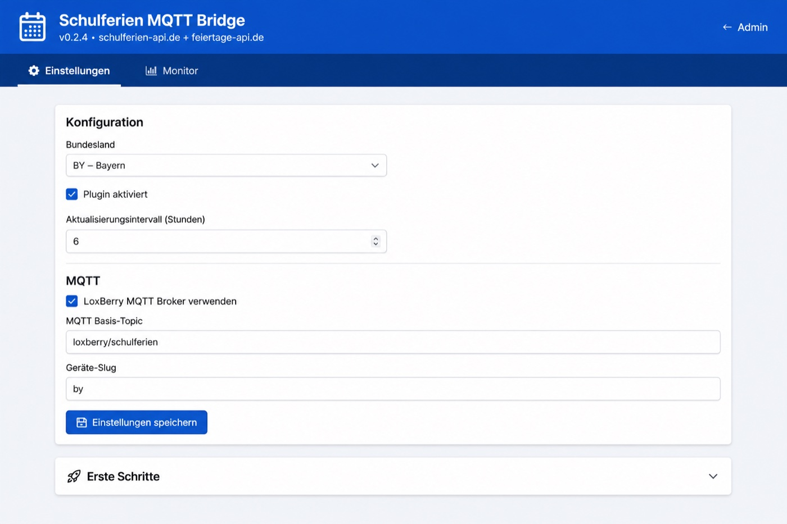
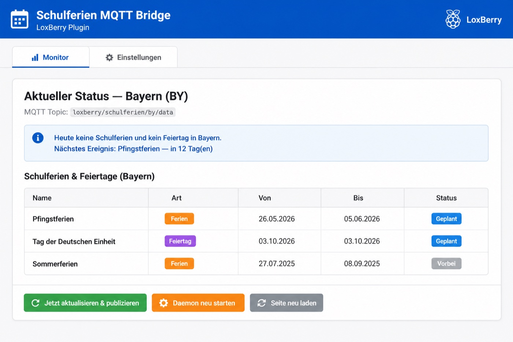
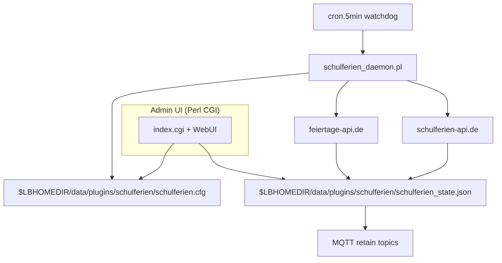
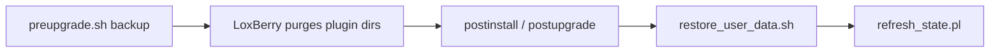

# loxberry-schulferien

[](https://github.com/rstein-prog/loxberry-schulferien/releases)
[](https://wiki.loxberry.de/)
[](https://www.perl.org/)

LoxBerry plugin that fetches **German school holidays** from
[`schulferien-api.de`](https://schulferien-api.de) and **public holidays** from
[`feiertage-api.de`](https://feiertage-api.de), merges them per Bundesland, and
publishes a compact **JSON** payload over **MQTT** — ready for the Loxone MQTT
Gateway with JSON expansion.

**Disclaimer (read this):** This project is **not** official, **not** endorsed by
schulferien-api.de, feiertage-api.de, their operators, the Kultusministerkonferenz,
or German state authorities. It is a **community best-effort** tool using **public,
free APIs** with a **minimum 6-hour** poll interval to avoid unnecessary load.
Data may be **incomplete or outdated**; official publications remain authoritative.
Full text: **Legal notice** accordion in the plugin admin UI (DE/EN).

## Table of contents

- [Features](#features)
- [Screenshots (admin UI)](#screenshots-admin-ui)
- [Data sources](#data-sources)
- [Supported states](#supported-states)
- [Installation](#installation)
- [Configuration](#configuration)
- [MQTT topics & JSON format](#mqtt-topics--json-format)
- [Loxone Miniserver](#loxone-miniserver)
- [Architecture](#architecture)
- [Building & development](#building--development)
- [Runtime compatibility](#runtime-compatibility)
- [Best-practice alignment](#best-practice-alignment)

## Features

- **Admin UI in German and English** — follows LoxBerry system language (`templates/lang/language_*.ini`).
- **All 16 Bundesländer** selectable; device slug defaults to lowercase state code (e.g. `by`).
- **School holidays + public holidays** merged for status, monitor table, and MQTT.
- **Nested JSON** (`now` / `soon` groups) — avoids Loxone MQTT Gateway `##` naming artefacts on flat keys.
- **Daemon** with configurable poll interval (default **6 h**, minimum **6 h**, max **168 h**).
- **Cron watchdog** (`cron.5min`) restarts the daemon if stopped while enabled.
- **Settings persist across plugin updates** — user config and cache live under
  `$LBHOMEDIR/data/plugins/schulferien/`; `preupgrade.sh` / `postupgrade.sh` restore after LoxBerry wipes plugin folders.
- **MQTT** — LoxBerry broker auto-detect from `general.json` / MQTT Gateway credentials, or manual host/port/user.
- **Icons:** `icons/icon_*.png` → LoxBerry overview; `webfrontend/htmlauth/icon_64.png` in plugin header. `ICON=icon_64.png` in `plugin.cfg`.

## Screenshots (admin UI)

German admin UI previews (representative mockups of the plugin web interface):

**Einstellungen / Settings**



**Monitor** (status, holiday table, MQTT actions)



## Data sources

| Source | URL | Content |
|--------|-----|---------|
| School holidays | [`schulferien-api.de`](https://schulferien-api.de) | Winter, Easter, Pentecost, summer, autumn, Christmas breaks |
| Public holidays | [`feiertage-api.de`](https://feiertage-api.de) | Statutory holidays per Bundesland |

Both APIs are fetched for the **current and next calendar year**. No registration required.

**Beginner path:** (1) **Settings** → pick Bundesland → save. (2) **Monitor** → **Refresh now & publish**. (3) Optional: adjust poll interval and MQTT. Problems → daemon log in **Monitor** tab.

## Supported states

All German federal states supported by both APIs:

`BW`, `BY`, `BE`, `BB`, `HB`, `HH`, `HE`, `MV`, `NI`, `NW`, `RP`, `SL`, `SN`, `ST`, `SH`, `TH`

## Installation

### On a LoxBerry appliance

1. Download the latest **`loxberry-schulferien.zip`** from
   [GitHub Releases](https://github.com/rstein-prog/loxberry-schulferien/releases).
2. **System → Plugins** → install / update.
3. Open the plugin → **Settings**: choose Bundesland → **Save**.
4. **Monitor** → **Refresh now & publish** (or wait for the daemon poll).

**Install from URL:** use the **release asset** ZIP link
(`…/releases/download/vVERSION/loxberry-schulferien.zip`), not “Source code”.

**After upgrade:** settings and cached state are restored automatically. If the holiday list looks stale, use **Refresh now & publish** once.

### Local development

```bash
git clone https://github.com/rstein-prog/loxberry-schulferien.git
cd loxberry-schulferien
perl -Ibin -c bin/Schulferien/API.pm
perl -Ibin -c webfrontend/htmlauth/index.cgi
bash build_package.sh
```

Output: `dist/schulferien_<version>.zip`

## Configuration

### 1) Bundesland & poll interval

In **Settings**:

- **Bundesland** — state code for API queries and MQTT slug default.
- **Update interval (hours)** — default **6**, minimum **6**, maximum **168**.
- **Plugin enabled** — master switch for the daemon.

User settings are stored in:

```text
$LBHOMEDIR/data/plugins/schulferien/schulferien.cfg
```

Shipped defaults (read-only after install):

```text
$LBHOMEDIR/config/plugins/schulferien/schulferien.cfg
```

### 2) MQTT

- **Use LoxBerry MQTT broker** — reads host, port, and credentials from LoxBerry system config.
- **Base topic** — default `loxberry/schulferien`.
- **Device slug** — default `by`, `rp`, … (lowercase state); used in topic paths.

Retained topics after each successful fetch:

```text
<base>/<slug>/availability   → online | offline
<base>/<slug>/data            → JSON payload (see below)
```

Example with defaults for Bayern:

```text
loxberry/schulferien/by/availability
loxberry/schulferien/by/data
```

## MQTT topics & JSON format

Top-level payload (nested for Loxone MQTT Gateway):

```json
{
  "state": "BY",
  "now": {
    "active": 1,
    "name": "Sommerferien",
    "start": "2026-08-03",
    "end": "2026-09-14",
    "left": 22,
    "school": {
      "active": 1,
      "name": "Sommerferien",
      "start": "2026-08-03",
      "end": "2026-09-14",
      "left": 22
    },
    "public": {
      "active": 0,
      "name": "",
      "date": ""
    }
  },
  "soon": {
    "name": "Herbstferien",
    "start": "2026-11-02",
    "end": "2026-11-06",
    "in": 71,
    "len": 5,
    "school": { "name": "Herbstferien", "start": "2026-11-02", "end": "2026-11-06", "in": 71, "len": 5 },
    "public": { "name": "Tag der Deutschen Einheit", "start": "2026-10-03", "in": 41 }
  }
}
```

| JSON path | Type | Description |
|-----------|------|-------------|
| `now.active` | 0 / 1 | Free day today (school break **or** public holiday) |
| `now.name` | text | Current name (combined) |
| `now.left` | number | Remaining school-break days (0 on public-holiday-only days) |
| `now.school.*` | object | School holidays only |
| `now.public.*` | object | Public holiday only (`active`, `name`, `date`) |
| `soon.*` | object | Next event (school or public); see `soon.school` / `soon.public` |

## Loxone Miniserver

1. MQTT Gateway → **Expand JSON** enabled.
2. Subscribe: `loxberry/schulferien/<slug>/#`
3. Example virtual inputs (Bayern, slug `by`):

```text
loxberry_schulferien_by_data_now_active
loxberry_schulferien_by_data_now_left
loxberry_schulferien_by_data_now_school_active
loxberry_schulferien_by_data_now_public_active
loxberry_schulferien_by_data_soon_in
```

Use `now.active = 1` for heating holiday mode; `now.public.active = 1` to react on public holidays only.

## Architecture

**Stack:** Perl 5, `LWP::UserAgent`, `JSON::PP`, `Net::MQTT::Simple`. Admin UI:
`webfrontend/htmlauth/index.cgi` + `bin/Schulferien/WebUI.pm`. Daemon:
`bin/schulferien_daemon.pl`. **i18n:** `bin/Schulferien/Lang.pm` +
`templates/lang/language_*.ini`.

### Runtime data flow (simplified)



### Update-safe user data



LoxBerry **deletes** `data/plugins/<folder>/` and `config/plugins/<folder>/` on plugin update.
This plugin backs up to `/tmp/${PTEMPDIR}_schulferien_userdata` before upgrade and restores
config, auth cache, and state after install.

## Building & development

```bash
bash build_package.sh
```

Packages `plugin.cfg`, `bin/`, `config/`, `cron/`, `webfrontend/`, `templates/`, install hooks, and icons into
`dist/schulferien_<version>.zip`.

Optional: copy to repo root for releases:

```bash
cp "dist/schulferien_$(awk -F= '/^VERSION=/{print $2}' plugin.cfg).zip" loxberry-schulferien.zip
```

Icon generation (if Pillow available):

```bash
python3 tools/generate_icons.py
```

## Runtime compatibility

- LoxBerry ≥ 2.0 (`LB_MINIMUM=2.0.0` in `plugin.cfg`).
- Perl modules: `LWP::UserAgent`, `JSON::PP` (usually preinstalled); `Net::MQTT::Simple`
  (`libnet-mqtt-simple-perl` or `cpanm Net::MQTT::Simple`) — installed via `postinstall.sh` if missing.
- Outbound HTTPS to `schulferien-api.de` and `feiertage-api.de`.

## Best-practice alignment

- LoxBerry layout: `plugin.cfg`, `webfrontend/`, `config/`, `data/`, `cron/`, `daemon/`,
  install hooks (`preinstall`, `preupgrade`, `postinstall`, `postupgrade`, `postroot`).
- User-writable paths under **`data/plugins/schulferien/`** (not `config/` alone).
- Guidance: [LoxBerry Developer Wiki](https://wiki.loxberry.de/entwickler/start).

## About

Community LoxBerry plugin — **Schulferien MQTT Bridge**. Not affiliated with the API operators.

Maintainer: Robert Stein
